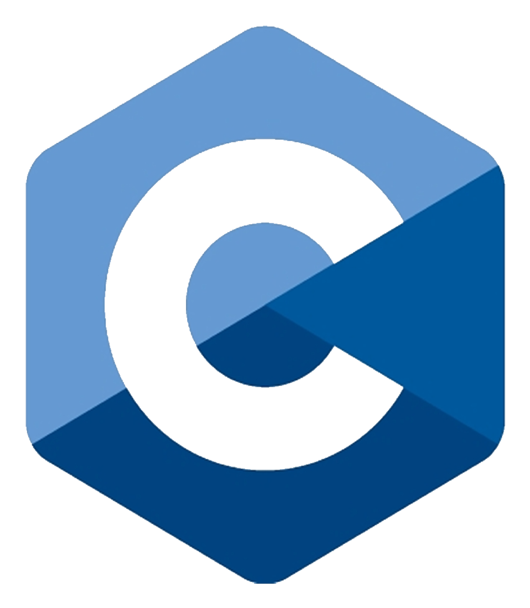

# **C Programming**


This repository aims to guide you through the world of **modern C++** using popular toolchains. Each topic resides in its own folder, and projects are organized accordingly. Most directories come with a `CMakeLists.txt`, making compilation easier with `CMake`.

> Software doesn't run on magic; it's powered by the expertise of developers.

## Languages
**C/C++, Objective-C/C++**

   

```cpp
class person {
public:
    explicit person() = default;
    explicit person(const std::string& fn, const std::string& ln)
    : first(fn)
    , last(ln) {}
    explicit person(std::string&& fn, std::string&& ln)
    : first(std::move(fn))
    , last(std::move(ln)) {}
    person(const person& rhs) = default;
    person& operator=(const person&);
    person(person&& rhs) noexcept = default;
    person& operator=(person&& rhs) noexcept;
    [[nodiscard]] inline std::string& firstname() { return first; }
    inline const std::string& firstname() const { return first; }
    [[nodiscard]] inline std::string& lastname() { return last; }
    inline const std::string& lastname() const { return last; }
private:
    std::string first;
    std::string last;
};
```

## **Getting Started**
**Example to Compile a File Named `get_tie.cpp`**

```bash
$ g++ --version
$ cd ./StandardTemplateLibrary/Tuple
$ g++ -g -Wall -Wextra -Wpedantic -c get_tie.cpp -o get_tie.exe -std=gnu++2b
$ ./get_tie
```

**To Update `MinGW` on Windows**
Run PowerShell as Administrator and execute:

```bash
$ mingw-get update
$ mingw-get upgrade
$ gcc --version
$ g++ --version
```

## **Repository Directories**
If you already have `CMake` configured, simply navigate to the directory with a `CMakeLists.txt` and run:

```bash
$ cmake .
```

or

```bash
$ cmake ./CMakeLists.txt
```

For example, to change to the `./DesignPatterns` directory:

```bash
$ cd ./DesignPatterns
$ cmake ./CMakeLists.txt
```

Conventionally, create a folder dedicated to `CMake` files, such as `build` or `bin`:

```bash
$ cd ./DesignPatterns
$ mkdir build
$ cd build
$ cmake ../CMakeLists.txt -G "Visual Studio 17 2022"
```

To build with popular generators like `Ninja` or `MinGW`:

```bash
$ cmake ../CMakeLists.txt -G "Ninja"
$ cmake ../CMakeLists.txt -G "MinGW Makefiles"
```

### `./Util` and `./Util/tests`
These folders contain functionality provided by separate modules. A `util` namespace is created for better management of functions. Tests and `GoogleTest` are located within the `Util/tests` folder.

```cpp
namespace util {
    namespace data_structure {}
    namespace list {}
    namespace math {}
    namespace parse {}
    namespace pointer {}
    namespace range {}
    namespace type {}
    namespace type_safety {}
    namespace vector {}
}
```

Contains template (generic) functions in a C-style header file, providing various functionalities.

### `./HackerRank`
Contains solutions to basic problem-solving coding questions, with file names usually describing the content. `README.md` provides additional notes for these problems.

### `./ObjectiveC`
Covers popular concepts in Objective-C, compiled in Windows using GNUstep Core and GNUstep developer tools.

### [`./Projects`](https://github.com/poboll/C/tree/master/Project)
Contains projects from coursework and personal projects, including building a terminal progress bar for visual effects and working with the `OpenGL` library in `C++`.

### [`./LeetCode`](https://github.com/poboll/C/tree/master/LeetCode), [`./AcWing`](https://github.com/poboll/C/tree/master/AcWing), [`./luogu`](https://github.com/poboll/C/tree/master/luogu), [`./亲爱的你，不要以为别人发光就觉得自己暗淡。`](https://github.com/poboll/C/tree/master/%E4%BA%B2%E7%88%B1%E7%9A%84%E4%BD%A0%EF%BC%8C%E4%B8%8D%E8%A6%81%E4%BB%A5%E4%B8%BA%E5%88%AB%E4%BA%BA%E5%8F%91%E5%85%89%E5%B0%B1%E8%A7%89%E5%BE%97%E8%87%AA%E5%B7%B1%E6%9A%97%E6%B7%A1%E3%80%82), [`./新特性`](https://github.com/poboll/C/tree/master/%E6%96%B0%E7%89%B9%E6%80%A7)
Includes current work, personal projects, and templates for various competitions and learning about new features in `C++11`.

## References
### **Commonly Used Commands in `CMake`**
* [`target_sources`](https://cmake.org/cmake/help/latest/command/target_sources.html)
* [`target_compile_options`](https://cmake.org/cmake/help/latest/command/target_compile_options.html)
* [`target_compile_definitions`](https://cmake.org/cmake/help/latest/command/target_compile_definitions.html)
* [`target_include_directories`](https://cmake.org/cmake/help/latest/command/target_include_directories.html)
* [`target_link_libraries`](https://cmake.org/cmake/help/latest/command/target_link_libraries.html)